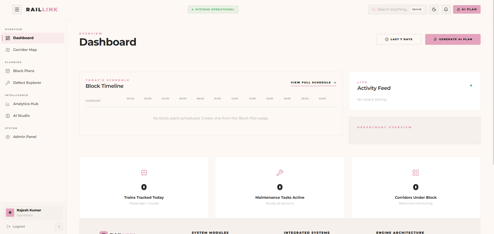
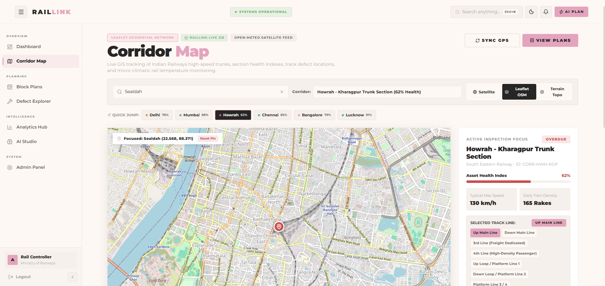
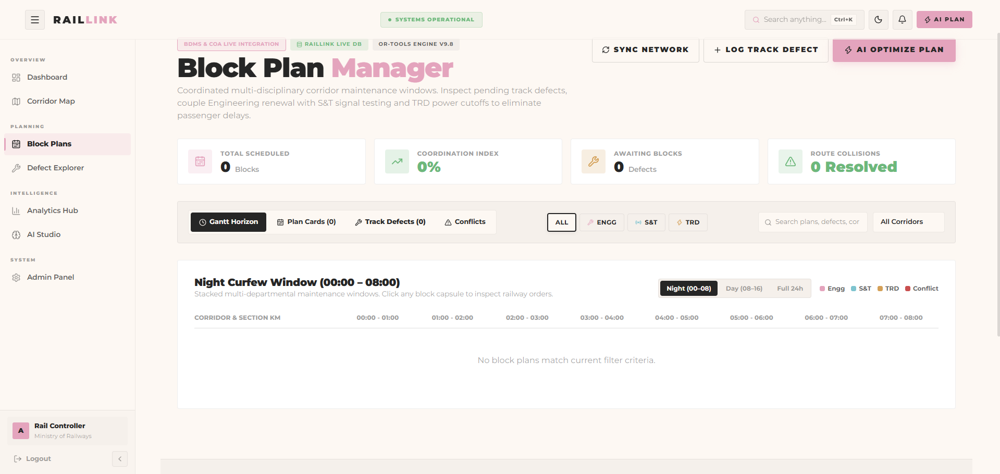
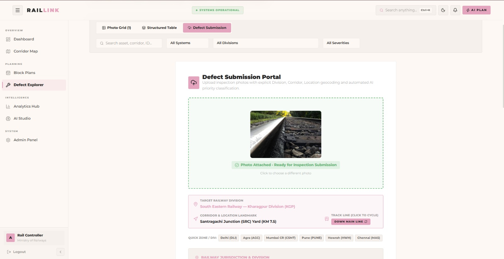
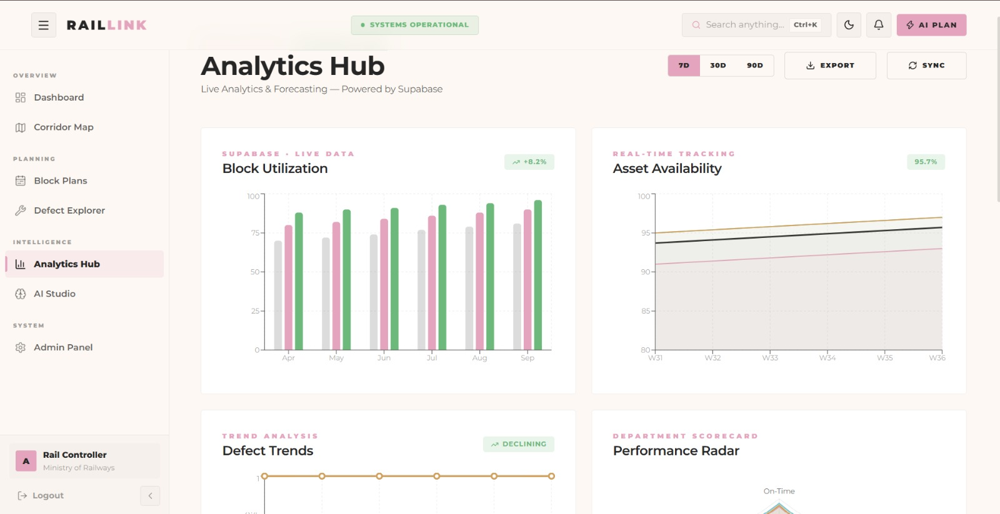
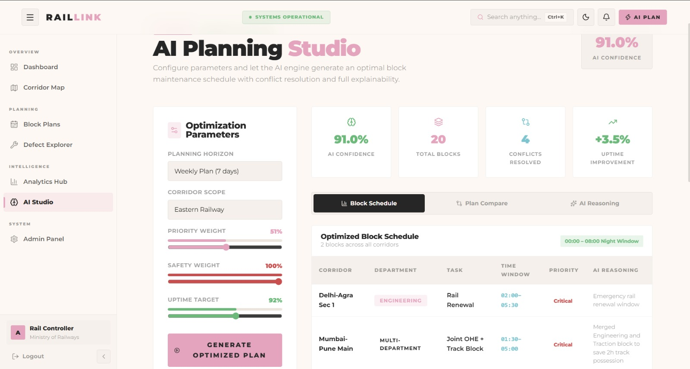

<h1 align="center">🚆 RAILLINK</h1>
<h3 align="center">AI-Powered Automatic Block Planning & Defect Management for Indian Railways</h3>
<p align="center">
  <p align="center">
  <strong>Smarter maintenance. Safer tracks. Faster decisions.</strong>
</p>
<p align="center">
  
  
  
</p>

## 📸 Screenshots
| Dashboard | Interactive Map |
|-----------|----------------|
|  |  |

| Block Plans | Defect Reporting |
|-------------|-----------------|
|  |  |

| Analytics | AI Studio |
|-----------|-----------|
|  |  |

---

## 🎯 What is RailLink?

Indian Railways manages maintenance on over **68,000 kilometers** of track daily. Engineers schedule maintenance blocks and inspectors report defects — traditionally done manually, with paper forms and phone calls.

**RailLink** digitizes and automates this entire process. It brings block planning, defect tracking, AI-powered photo analysis, and real-time analytics into a single intelligent platform — designed specifically for the scale and complexity of Indian Railways operations.

---

## ✨ Key Features

| Feature | Description |
|---------|-------------|
| 🗺️ **Interactive Railway Map** | Live section status across India with clickable stations |
| 📋 **AI Block Planning** | Auto-generate optimized maintenance block plans using Gemini AI |
| 📷 **AI Defect Reporting** | Upload a photo → AI auto-fills defect type, severity & recommendations |
| 📊 **Analytics Dashboard** | Real-time defect trends, block completion rates, section health scores |
| 🤖 **AI Studio** | Natural language queries for intelligent track insights |
| 👥 **Role-Based Access** | Admin, Supervisor, and Inspector roles with granular permissions |

---

## 🛠️ Tech Stack

### Frontend


### Backend


### Database & Auth


### 📸 Media Storage

<div align="center">

## ☁️ CLOUDINARY
### Media Upload · Storage · CDN Delivery · AI-Ready Image Processing

[](https://cloudinary.com)

> Every defect inspection photo is **uploaded, optimized, and globally delivered** through Cloudinary.
> Cloudinary powers the mandatory photo evidence system in RailLink — enabling instant Gemini AI vision analysis on every defect submitted.

</div>

### AI


### Deployment


---

## 🏗️ Project Architecture

```
RailLink/
├── client/                  # React + Vite Frontend
│   ├── src/
│   │   ├── pages/           # Dashboard, Map, Plans, Defects, Analytics, AI Studio, Admin
│   │   ├── components/      # Navbar, Sidebar, shared UI
│   │   ├── store/           # Zustand global state management
│   │   └── lib/             # Railway location data, utilities
│   └── vite.config.js
│
├── server/                  # Node.js + Express API Gateway
│   ├── src/
│   │   ├── routes/          # auth, defects, plans, sections, analytics, ai, upload
│   │   ├── services/        # Supabase, Cloudinary, Gemini integrations
│   │   └── app.js           # Express app + static file serving (SPA)
│   └── package.json
│
├── render.yaml              # One-click Render deployment config
├── SETUP_SUPABASE_ALL_IN_ONE.sql
└── package.json             # Monorepo root scripts
```

---

## 🚀 Local Setup

### Prerequisites
- Node.js 18+
- Supabase account → [supabase.com](https://supabase.com)
- Cloudinary account → [cloudinary.com](https://cloudinary.com)
- Google Gemini API key → [ai.google.dev](https://ai.google.dev)

### 1. Clone the repo
```bash
git clone https://github.com/nonsense3/RailLink.git
cd RailLink
```

### 2. Install dependencies
```bash
npm install
cd client && npm install && cd ..
cd server && npm install && cd ..
```

### 4. Set up the database
Run the SQL file in your Supabase SQL editor:
```
SETUP_SUPABASE_ALL_IN_ONE.sql
```
### 5. Start development
```bash
npm run dev
```
App runs at → `http://localhost:5173`
---
## ☁️ Deploy to Render
1. Push to GitHub
2. Go to [render.com](https://render.com) → New → Blueprint
3. Connect your repo — Render auto-reads `render.yaml`
4. Select **`raillink-app`** (Web Service)
5. Add all environment variables in the Render dashboard
6. Click **Deploy**
The Express server serves both the API and the built React SPA — no separate static site needed. All routes (including `/admin`, `/map`, `/defects`) work correctly on refresh.
---
## 👥 Team Members

| Name | Role | GitHub |
|------|------|--------|
| **Ankit Dey** | Full Stack Lead | [@handle](https://github.com/handle) |
| **Souvik Das** | Backend & Database | [@handle](https://github.com/handle) |
| **Sanchari Ganguly** | Frontend & UI/UX | [@handle](https://github.com/handle) |
| **Rashmi Pyne** | AI & Analytics | [@handle](https://github.com/handle) |

---

## 📄 License

Built for educational and hackathon demonstration purposes.

---

<p align="center">
  Built with ❤️ for Indian Railways<br/>
  by TEAM METAXL
</p>
